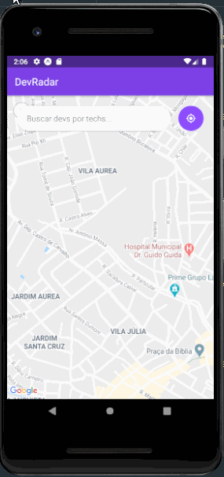
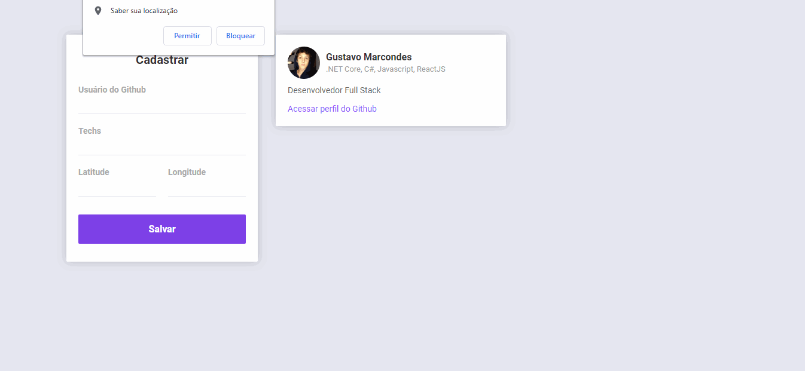

# DevRadar - Omnistack Week Rocketseat

## Projeto feito na Semana Omnistack 10 da Rocketseat

### Na semana 10 foram abordadas as seguintes tecnologias:

- [NodeJS](https://nodejs.org/en/)

- [ReactJS](https://github.com/facebook/react)

- [React Native](https://github.com/facebook/react-native)

- [Expo](https://github.com/expo/expo)

- [WebSockets com socket.io](https://socket.io/)

- [Axios](https://github.com/axios/axios)

- [Font Awesome](https://github.com/FortAwesome/react-fontawesome)